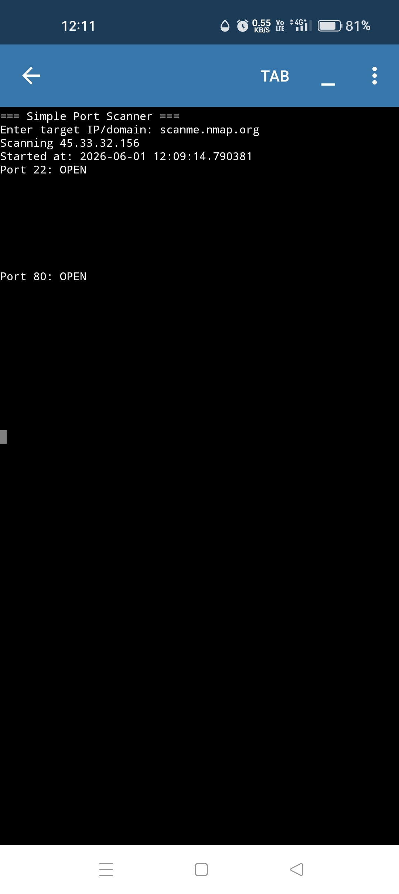

1  # port-scanner
2  
3  A simple Python port scanner to check open ports 1-1024. Built for Class 10 Cyber Security Project.
4  
5  ### Output Screenshot
6  
7  
8  
9  ### Disclaimer
10 
11 This tool is for educational purposes only. Do not use on networks you do not own.
